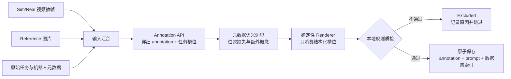

# Sim2Real Prompt Annotation

本工具是 Wan2.2 Multi-View Sim-to-Real Transfer 项目专用的 Prompt 标注 pipeline。
每个 paired LeRobot episode 只生成两项核心结果：

1. 一份详细、可审计的结构化标注；
2. 一个用于训练的精简 Prompt。

```text
Sim/Real 视频抽帧 + Reference + 原始任务标注
        → Annotation API
        → 确定性渲染 Prompt
        → 确定性本地质检
        → 通过后保存
```

每个 episode 的默认主线只有五步：

1. 对 Sim/Real 视频抽帧，读取同 episode 的 `Reference` 和原始任务/机器人元数据；
2. 调用一次多模态 Annotation API，生成详细 annotation 与严格的任务语义槽位；
3. 由本地 renderer 从 `robot/active_arm/action/objects/goal/constraints` 和粗粒度
   外观字段确定性组合最终 Prompt；
4. 只检查会影响 Prompt 正确性的任务元数据冲突、外来任务概念、轨迹内容与长度；
5. 质检通过才保存 canonical annotation、Prompt 并写入 `episodes_prompt.jsonl`。



这里没有 raw candidate 复用、Prompt repair API、内容纠错循环或整条 episode 重试。
Reference 缺失/异常或最终 Prompt 的硬规则不通过会直接标记为 `excluded`。整条业务主线
只有一次 Annotation API，不再包含 Critic 或其他模型调用。仅保留请求级网络重试，以及
API 返回 malformed JSON 时的 schema 重试；它们只负责请求可靠性，不改变业务流程。
请求级重试只覆盖网络错误、限流及服务端错误；参数、鉴权等不可恢复的 HTTP 4xx 会立即
失败。

## 条件职责

- Sim 和 RobotState 控制机器人与物体运动、接触、状态变化、空间关系、相机视角、构图和时序；
- Prompt 定义高层任务、最终目标环境/外观/光照，并明确选择 Reference 中要使用的内容；
- Reference 是未经区域拆分的整张随机帧，可包含无关内容，仅提供 Prompt 所选择的机器人、
  任务物体、工作台或背景视觉证据；
- Real Video 是目标域标注证据和训练监督。

Prompt-critical 字段实行更窄的来源边界：原始任务元数据独占动作、主动臂、任务物体、
目标关系和完成约束；视频和 Reference 可以丰富详细 annotation，但不能向这些字段加入
任务语义。每个 action/object/goal/constraint 槽位必须引用原始任务字符串中的最小原文
片段。程序允许中文、粘连英文、词形变化以及合理的片段重叠，只拒绝明显无法由任务元数据
支持的外来概念。随机帧里可见但元数据未命名的内容只能作为 incidental observation，
renderer 永远不会读取它们。该机制不依赖任务分组，也不硬编码当前测试集的物体类别。

外观冲突时遵循：

```text
Prompt 显式属性 > Reference 外观 > Sim 外观
```

结构化标注保留 Sim invariants、任务物体语义角色、几何/affordance、目标 Real 外观、
Reference 可见范围、证据与置信度。`task.semantics` 只包含元数据派生的任务槽位，不再有
API 自由生成的 `prompt_plan/task_clause/setting_clauses`。最终 Prompt 不包含轨迹、动作
阶段、逐帧状态、相机参数或冗余质量口号。Lighting 始终写入 Prompt，不作为 Reference
scope。

典型 Prompt：

```text
Real-world video of the Agilex CobotMagic2 dual-arm robot using its left arm to place a green mug onto a black coaster. Match robot appearance, task-object appearance, workspace appearance, and background appearance to the reference image. Render the scene with a white tabletop, gray partition walls, and diffuse overhead lighting.
```

Prompt 固定采用 2～3 句自然语言，顺序为“任务/场景 → Reference 使用范围 → 目标呈现”。
Reference 句使用一个动态模板 `Match {appearance scopes} to the reference image.`，只渲染
该 episode 的 `reference.use_for` 所选择的可靠范围；没有任何可靠范围时直接排除该 episode。
默认以 55 个英文词为紧凑目标，以 64 个词和 560 个字符为质检硬上限。固定句式已经精简，
64 words 仍作为防止 Prompt 冗长的严格边界。Renderer 会把 workspace、background 和
lighting 分别压到 6/8/6 words，完整描述仍保留在 annotation 中。固定句式、任务语法、Reference scope 和场景
连接词全部由 renderer 生成；API 没有输出最终文案的接口。真正超限的内容会在渲染后的
本地质检中被拒绝并跳过，不截断、不修复、不重新生成。

内容质检失败写入 `logs/excluded_samples.jsonl`，API/文件系统等运行故障写入
`logs/failures.jsonl`。重新运行默认只跳过已有 canonical annotation 的成功样本；
`--force` 会重新执行主线。硬错误仅包括：任务或机器人元数据冲突、明显不受任务元数据支持
的外来任务概念、主动臂冲突、Prompt 混入轨迹/动作阶段，或渲染结果超过 64 words/
560 characters。字符覆盖率、片段重复、source/evidence/confidence 和视觉描述措辞不参与
Prompt 通过判定。

Annotation 每个 Sim/Real 视角使用 `media.max_frames` 个时序帧；4 帧是 Qwen 视频序列接口
允许的最小值。少于 4 帧的短 episode 会按顺序作为独立图片输入。

## 数据格式

只支持 paired LeRobot episode。Sim 视频 key 以 `_sim` 结尾，对应 Real key 为去掉
`_sim` 后的同名 key：

```text
data/
  paired_task/
    meta/
      info.json
      episodes.jsonl
    labels/
      labels.json                       # optional
    videos/chunk-000/
      observation.images.camera_head/
        episode_000000.mp4              # Real
      observation.images.camera_head_sim/
        episode_000000.mp4              # Sim
```

Reference 从同 episode 的 `reference_view` Real 视频中按 `reference_seed` 可复现地
随机选择一帧。不进行最佳帧搜索。实际视角和帧号写入 canonical annotation 与
`episodes_prompt.jsonl`，供训练侧使用同一张图。如果 `Reference` 及
`meta/reference_images.jsonl` 已存在且校验一致，Prompt 阶段直接读取 JPEG，不再从
Real 视频重复解码该帧。Prompt 标注阶段不会回退到 Real 视频重新抽取 Reference；
图片或 manifest 缺失、损坏、不一致时，该 episode 会在调用 API 前标记为
`excluded` 并跳过，原因记录在 `logs/excluded_samples.jsonl`；其他 episode 继续处理。
完整性审计仍会列出被排除的 episode，避免静默丢失训练数据。

## 安装与配置

需要 Python 3.10+：

```bash
python3 -m pip install -e .
cp config.example.yaml config.yaml
```

设置 Qwen OpenAI-compatible API：

```bash
export DASHSCOPE_API_KEY='your-key'
export DASHSCOPE_BASE_URL='your-openai-compatible-endpoint'
```

API key 不应写入代码、YAML 或日志。YAML 相对路径以配置文件所在目录为基准。

## 运行

```bash
sim2real-prompt references \
  --config config.yaml \
  --dataset-glob 'paired_task_*'

sim2real-prompt run \
  --config config.yaml \
  --dataset-glob 'paired_task_*'
```

可用 `--episodes 0,2,5-9` 或 `--limit N` 选择子集。默认断点续跑；仅在需要重新调用
API 时使用 `--force`。

检查输入及随机 Reference 帧：

```bash
sim2real-prompt run \
  --config config.yaml \
    --dataset-glob 'paired_task_*' \
    --dry-run --prepare-media
```

将确定性选择的同 episode Reference 帧以全分辨率 JPEG 写入数据集：

```bash
sim2real-prompt references \
  --config config.yaml \
  --dataset-glob 'paired_task_*'
```

默认写入 `<dataset>/Reference/episode_000000.jpg`，并将视角、帧号、随机种子、
相对路径和 SHA-256 写入 `<dataset>/meta/reference_images.jsonl`。重复运行会跳过内容
一致的图片；只有显式传入 `--overwrite` 才会覆盖冲突文件。

审计当前输出：

```bash
sim2real-prompt audit \
  --config config.yaml \
  --dataset-glob 'paired_task_*'
```

从 canonical annotation 重新渲染 Prompt：

```bash
sim2real-prompt render \
  --config config.yaml \
  --annotation outputs/annotations/paired_task__episode_000000.json
```

## Python 接口

```python
from sim2real_prompt_annotation import PromptAnnotationPipeline

pipeline = PromptAnnotationPipeline("config.yaml")
result = pipeline.run(dataset_glob="paired_task_*", episodes="0-2")
audit = pipeline.audit(dataset_glob="paired_task_*")
```

## 输出

```text
outputs/
  annotations/           # canonical detailed annotation
  validations/           # deterministic local QC result
  prompts/               # one .txt per episode
  logs/
    requests.jsonl
    excluded_samples.jsonl
    failures.jsonl
    completion_report.json
    incomplete_samples.jsonl
```

训练 Prompt 聚合到每个源数据集：

```text
<dataset>/meta/episodes_prompt.jsonl
```

每行格式：

```json
{"episode_index":0,"prompt":"Real-world video of ...","reference_view":"camera_head","reference_frame_index":42}
```

部分 episode 运行只替换对应行，其他已有行会保留。旧版
`{"prompts":{"full":...}}` 多版本格式不再兼容。
